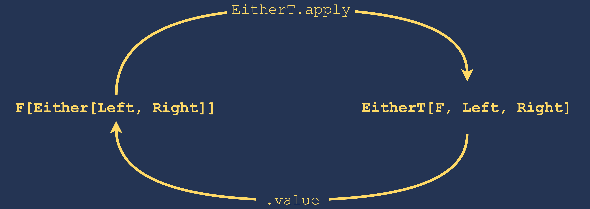

autoscale: true
slide-transition: true

^ Thank you for being here, and thanks to the conference organizers for having me today. 
This is a talk on managing errors in functional applications, based on my personal experience writing Scala apps
for the last few years. I hope you enjoy it.


# [fit] IO Monad & Error management
## [fit] From Exceptions to Cats MTL
## @bogardguillaume - guillaumebogard.dev

---

^ Before we dig in, a few words about me: 

# Bonjour ! 👋

My name is **Guillaume Bogard**. I'm a Scala Developer @Linkvalue.

I love functional programming, roller-coasters, and Age of Empires.

<br />

You can follow me on Twitter @bogardguillaume and on [guillaumebogard.dev]()

---

# [fit] Let's talk about IO monads

---

^ 1 : Monads have a type constructor from A to M[A]
2 : All monads have a flatMap method that can chain computations. Composition is key part of what monads are. Model computation
that depends on the result of a previous computation
3 : The why : Monads are used to enrich a computation with an additional effect. You need M[A] when A alone is not enough.
The effects are reflected in the type signature of the value which means they're known by the compiler and must be
explicitly dealt with

[.build-lists: true]

# The *M Word*, a quick recap

**A Monad `M[A]` is an immutable data structure used to describe the computation of one or more values of type `A`**

- Values of type `A` can be turned into *monadic values* `M[A]` 
- Monads can chain subsequent computations (i.e solve big problems out of smaller problems)
- They describe some *functional effect*: `Option` describes optionality, `Either` describes failure, `List` describes
non-determinism

---

[.build-lists: true]

# Why do we need IO anyway ?

^ Referentially transparent values mean we can define then in any order, pass them
around, compose them, without any fear of unwanted execution

^ Encode as much as possible in types.
Make side effects obvious.
Signatures as contracts

- `IO`s are **programs as values**.

   ```scala
   def getUser(id: String): IO[User]
   ```
- They turn impure programs into referentially transparent values.
- They reveal the presence of sneaky side effects 🐍 

- They **compose** :

  ```scala
  def getFavoritePet(user: User): IO[Pet]
  val marksFavoritePet: IO[Pet] = getUser("Mark") flatMap getFavoritePet
  ```

---

# When things go wrong

Cats effect allows to raise `Throwable`s inside the `IO` context, propagate them across all the `IO` chain, and recover them later.

```scala
val failedIO: IO[Int] = IO.raiseError(new Exception("Boom"))

failedIO.recoverWith({
  case e => IO {
    logger.error("Something went wrong", e)
    42
  }
}).unsafeRunSync() // => 42
```

---

^ I could create a program by composing several specialized IOs together
[.build-lists: true]

### Use case : Modeling an authentication flow

I want to authenticate a user using a name and a password. I need to return the user's information.

- I need to find the user information (maybe from a database)
- Check that the password is valid by comparing hashes
- I need to check that the user subscription is valid (maybe through a billing service)
- And the user must not be banned from our service

---

[.code-highlight: 1-5]
[.code-highlight: 6-10]
[.code-highlight: 12-18]
[.code-highlight: all]

```scala
case object WrongUserName extends RuntimeException("No user with that name")
case object WrongPassword extends RuntimeException("Wrong password")
case class ExpiredSubscription(expirationDate: Date) extends
  RuntimeException("Expired subscription")
case object BannedUser extends RuntimeException("User is banned")

def findUserByName(username: String): IO[User] = ???
def checkPassword(user: User, password: String): IO[Unit] = ???
def checkSubscription(user: User): IO[Unit] = ???
def checkUserStatus(user: User): IO[Unit] = ???

def authenticate(userName: String, password: String): IO[User] =
  for {
    user <- findUserByName(userName)
    _    <- checkPassword(user, password)
    _    <- checkSubscription(user)
    _    <- checkUserStatus(user)
  } yield user
```

---

[.code-highlight: all]
[.code-highlight: 5-13]
[.code-highlight: all]

```scala
authenticate("john.doe", "foo.bar")
  .flatMap(user => IO {
    println(s"Success! $user")
  })
  .recoverWith({
    case WrongUserName => IO { /* Do stuff ... */ }
    case WrongPassword => IO { /* Do stuff ... */ }
    case ExpiredSubscription(date) => IO { /* Do stuff ... */ }
    case BannedUser => IO { /* Do stuff ... */ }
    case _ => IO {
      println("Another exception was caught !")
    }
  })
```

---


[.build-lists: true]

^ Once the IO is ran, raised exceptions behave exactly like standard exceptions, meaning it will crash the jvm if not caught

# The issues with Exception

- ❌ Exceptions are invisible
- ❌ One can forget to recover them
- ❌ They must be explicitly documented 
- ❌ They can be ambiguous : 
  - `IO`s only raise and recover `Throwable`s. They don't distinguish between `java.util.concurrent.TimeoutException` & `AuthenticationException` at compile-time.
- ❌ You get no proper exhaustivity check

---

^ Exceptions don't appear in the signature, yet can have dramatic impact on the program.
Need to check for @throws in the scaladoc part, or even wose : read the implementation 
Should not have to do that since functions signatures are contracts

# This is a lie

```scala
def authenticate(userName: String, password: String): IO[User]
```

The method's signature doesn't convey anything about possible error cases. 

Unhandled errors will be propagated across the whole application once the IO is ran like good ol' Java when you forget to `try/catch`.

Requires more reading and more testing.

---

# [fit] Make exceptions
# [fit] exceptional again 
## [fit] ⚠️ Opinionated statements ahead

---

[.build-lists: true]

## Domain errors are not exceptions

- Domain errors are documented edge cases that can happen as part of the user experience.
e.g.: The user hasn't paid their subscription

- Exceptions should be reserved for unexpected, purely technical failures.
e.g.: The database server is unreachable.


---

^ One could also say : don't expose domain errors to your developers : no unnecessary logs etc.

## When a user is breaking a business rule, don't fail

## When you need to fail, fail *fast*

Exceptions should be propagated to the upper levels of the app and actively monitored.

## Don't expose technical errors to your users

---

[.code-highlight: 1-6]
[.code-highlight: 8-12]

## Modeling errors using an ADT

```scala
sealed trait AuthenticationError
case object WrongUserName extends AuthenticationError
case object WrongPassword extends AuthenticationError
case class ExpiredSubscription(expirationDate: Date) 
  extends AuthenticationError
case object BannedUser extends AuthenticationError

// Then our method could look like this :
def authenticate(
  userName: String, 
  password: String
): IO[Either[AuthenticationError, User]]
```

---

[.build-lists: true]

## What we've achieved

```scala
def authenticate(
  userName: String, 
  password: String
): IO[Either[AuthenticationError, User]]
```

- ✅ Side effects are obvious
- ✅ Domain errors are visible and cannot be forgotten
- ✅ Technical errors can still be raised and recovered
- ✅ No need to check the documentation for unhandled edge cases
- ✅ We have clearly distinct error families

---


## But we've lost something very important along the way

---

## We can't compose anymore!

❌ This does not compile

```scala
def findUserByName(username: String): IO[Either[AuthenticationError, User]] = ???
def checkPassword(user: User, password: String): IO[Either[AuthenticationError, Unit]] = ???
def checkSubscription(user: User): IO[Either[AuthenticationError, Unit]] = ???
def checkUserStatus(user: User): IO[Either[AuthenticationError, Unit]] = ???

def authenticate(userName: String, password: String): IO[Either[AuthenticationError, User]] =
  for {
    user <- findUserByName(userName)
    _    <- checkPassword(user, password)
    _    <- checkSubscription(user)
    _    <- checkUserStatus(user)
  } yield user
```

---

## We can't compose many `IO[Either[A, B]]` together. 😔

---

## We need something like this instead

```scala
def authenticate(userName: String, password: String): IO[Either[AuthenticationError, User]] =
  findUserByName(userName).flatMap({
    case Right(user) => checkPassword(user, password).flatMap({
      case Right(_) => checkSubscription(user).flatMap({
        case Right(_) => checkUserStatus(user).map(_.map(_ => user))
        case Left(err) => IO.pure(Left(err))
      })
      case Left(err) => IO.pure(Left(err))
    })
    case Left(err) => IO.pure(Left(err))
  })
```

Error handling shouldn't be this painful.

---


# Monad Transformers

---

^ In cats, monad transformers include EitherT, OptionT, EitherT, ReaderT (an alias for Kleisli)

## Monad transformers add new behavior to an underlying monad while preserving compositionality.

E.g : `OptionT[F, A]` creates a new monad which adds the effect of absence to a monad F.

They are type constructors that take a monad as an argument and return a monad.

---

## From `F[Either[A, B]` to `EitherT[F, A, B]`


`EitherT[F, L, R]` is a light wrapper around `F[Either[A, B]]` that makes it easy to compose `Either`s and `F`s together.

<br>

It has bidirectional transformation from/to `F[Either[A, B]]` via the `apply` and `value` methods respectively.

```scala
val a: IO[Either[AuthenticationError, User]] = ???
val b: EitherT[IO, AuthenticationError, User] = EitherT(a)
```

---



---

## Rewriting our authentication method

[.code-highlight: 1-4]
[.code-highlight: 6-12]
[.code-highlight: all]

```scala
def findUserByName(username: String): EitherT[IO, AuthenticationError, User] = ???
def checkPassword(user: User, password: String): EitherT[IO, AuthenticationError, Unit] = ???
def checkSubscription(user: User): EitherT[IO, AuthenticationError, Unit] = ???
def checkUserStatus(user: User): EitherT[IO, AuthenticationError, Unit] = ???

def authenticate(userName: String, password: String): EitherT[IO, AuthenticationError, User] =
  for {
    user <- findUserByName(userName)
    _    <- checkPassword(user, password)
    _    <- checkSubscription(user)
    _    <- checkUserStatus(user)
  } yield user
```

`EitherT` will short-circuit computation on the first encountered error, a pattern sometimes called *Railway-oriented programming* 🚂 

---

^ Instead of exposing EitherT in the signatures, you can also choose to lift IO[Either[A, B]]
when you actually need to perform the composition

```scala
def findUserByName(username: String): IO[Either[AuthenticationError, User]] = ???
def checkPassword(user: User, password: String): IO[Either[AuthenticationError, Unit]] = ???
def checkSubscription(user: User): IO[Either[AuthenticationError, Unit]] = ???
def checkUserStatus(user: User): IO[Either[AuthenticationError, Unit]] = ???


def authenticate(userName: String, password: String): EitherT[IO, AuthenticationError, User] =
  for {
    user <- EitherT(findUserByName(userName))
    _    <- EitherT(checkPassword(user, password))
    _    <- EitherT(checkSubscription(user))
    _    <- EitherT(checkUserStatus(user))
  } yield user
```

---

[.build-lists: true]

## Look how far we've come!

We've met all of our gaols :

- ✅ Side effects visible
- ✅ `IO`s and errors can be composed, railway style 
- ✅ We still get the benefit of having two distinct error channels :
  - Exceptions thrown inside the IO for purely technical failures
  - The *Left* of the `Either` for business-related errors

This way we can *fail fast* on technical failures and easily provide good feedback to the user for business edge cases.

---


# We've won, let's have a drink! 🍻

---

# Wait, but what about Cats MTL then?

---

# Challenges yet to address

- What about nested transformers ? What if I want to model mutable state **and** potential absence for example ?
- What about type inference and expressivity ?
  - Monad transformers requires many type many type annotations to work properly. The more you nest, the worst inference gets!

---

## Can you guess what this code does ?

```scala
// Retrieves document from a super secure data store
def getDocument: IO[SecretDocument] = ???

type Count = Int
val readSecretDocument: User => EitherT[IO, String, SecretDocument] = {
  val state: StateT[ReaderT[IO, User, *], Count, Either[String, SecretDocument]] =
    StateT[ReaderT[IO, User, *], Int, Either[String, SecretDocument]](currentAttemptsCount =>
      ReaderT[IO, User, (Count, Either[String, SecretDocument])](user =>
        if (currentAttemptsCount >= 3) IO.pure((currentAttemptsCount, Left("Max attemps exceeded")))
        else if (user.isAdmin) getDocument.map(doc => (currentAttemptsCount, Right(doc)))
        else IO.pure((currentAttemptsCount + 1, Left("Access denied")))
      )
    )

  state.run(0).map(_._2).mapF(EitherT(_)).run
}
```

---

### Me neither

---

When we need to combine effects (e.g short-circuiting AND mutable state), monad transformers alone only get us so far.

Scala's inference system can't keep up with nested monad transformers stack, requiring a ridiculous amount of boilerplate to get simple things done.

---

## The idea of Cats MTL

Remember that Monad transformers add some *effect* to a monad, e.g. :

- `EitherT` encodes the effect of short-circuiting on error
- `ReaderT` (i.e. `Kleisli`) encode the effect of accessing a read-only value from a context, and producing a value from it

---

### Cats MTL encodes the effect of the most common Monad Trasnformers in **type classes**. 

#### It gives the ability to combine effects together, without the drawback of bad inference.

---

^ Few things to note here : 
  - The F[_]: Applicative is a context bound
  - It isn't necessary
  - FunctorRaise wants you to provide the type of your errors, meaning you can rasie any type
  of errors you want, hence our ADT
  - You can add as many effects as you want to the F monad, just add the implicit parameter for the mtl type class you want to implement

### How would one encode the effect of raising errors ?

```scala
def readSecretDocument[F[_] : Applicative](user: User)
  (implicit F: FunctorRaise[F, String]): F[SecretDocument] =
  if (user.isAdmin) SecretDocument().pure[F]
  else F.raise("Access Denied!")
```

We've turned our `EitherT` into a generic `F[_]` Applicative. All we know about this `F[_]` is that there is an instance of `FunctorRaise` defined for it.

We'll need to provide a concrete implementation of `F` to run the program.

---

## What about recovering ?

```scala
def getDocumentContent[F[_] : Applicative](user: User)
  (implicit A: ApplicativeHandle[F, String]): F[String] =
  readSecretDocument[F](user)
    .map(_.content)
    .handle[String](_ => "Default content")
```

`ApplicativeHandle` extends `FunctorRaise` with the ability to handle errors.

---

## We still get a dedicate channel for technical failures

By adding a context bound on `ApplicativeError`, we can raise `Exception`s in our IOs, and segregate technical failures from domain errors 🙌

```scala
def findUserByName[F[_]](name: String)
  (implicit AE: ApplicativeError[F, Throwable]) = {
  AE.raiseError(new RuntimeException("Database not reachable!"))
}
```

---

## Implementing the `authenticate` method

[.code-highlight: 1-6]
[.code-highlight: 8-15]
[.code-highlight: all]

```scala
def checkPassword[F[_]](user: User, password: String)
  (implicit F: FunctorRaise[F, AuthenticationError]): F[Unit] =
  F.raise(WrongPassword)

def checkSubscription[F[_]](user: User): F[User] = ???
def checkUserStatus[F[_]](user: User): F[User] = ???

def authenticate[F[_]](userName: String, password: String)
  (implicit F: FunctorRaise[F, AuthenticationError], AE: ApplicativeError[F, Throwable]): F[User] =
  for {
    user <- findUserByName[F](userName)
    _ <- checkPassword[F](user, password)
    _ <- checkSubscription[F](user)
    _ <- checkUserStatus[F](user)
  } yield user
```

---

## Interpreting the program 🚀

It's time to provide a concrete implementation for the type classes we used. 

```scala
object Main extends App {
  type F[A] = EitherT[IO, AuthenticationError, A]
  authenticate[F]("john.doe", "123456")
}
```

---

# Summing up

- Shit happens, we need to handle it carefully
- Don't let technical details mess up your domain
  - Monad transformers let you add effects to existing monads, to create more *badass* monads
  - Cats MTL gives you this without the syntax headache
- Challenge your approach, there are plenty of error management strategies out there!
  Cats MTL is cool, but you might not need it
- Have fun!

---

[.footer: @bogardguillaume - guillaumebogard.dev]
# Thank you!

## Keep calm and curry on 

#### This talk is on GitHub : gbogard/cats-mtl-talk
